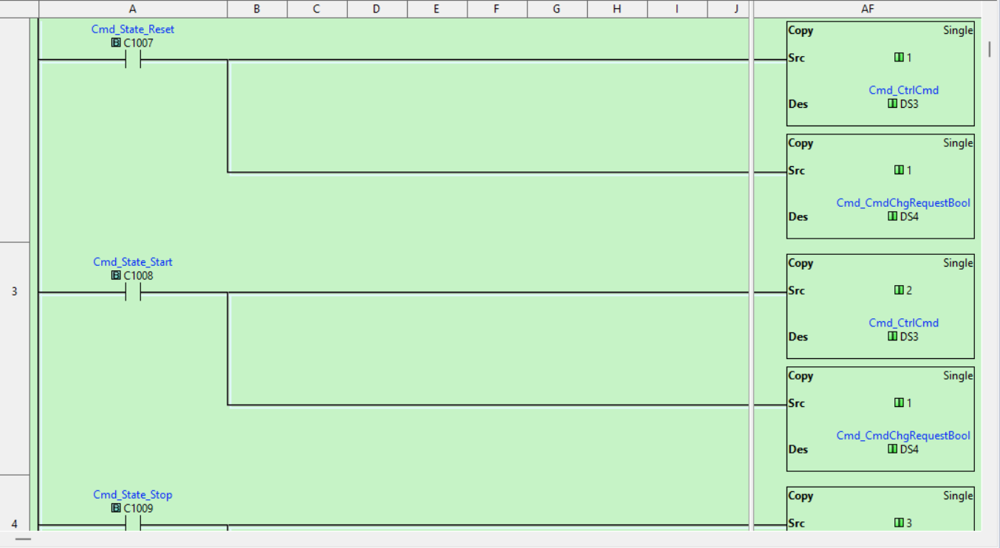

# The Complexity Was Never in the Logic

I run a small factory where all the machines run on Click PLCs. My coworkers can troubleshoot ladder and I may go six months between touching PLC code, so readability matters more than anything clever.

When I adopted a state machine model to structure our projects (idle, execute, stopped, aborted), I started with a Python-like cheatsheet to model the states and work through how they'd fit Click's memory and instruction set. The design part was fast. I could see the whole machine on a page, think through transitions, plan out the tags and alarms.

Then I had to put it into Click. Every comparison became a block to drag and fill in. Every tag reference meant typing raw addresses like DS12 or C47 because Click doesn't let you use nicknames while creating logic. A state machine I could describe in a page became forty subroutine files in the editor, each filling a full screen with contacts, coils, branch lines and whitespace.

I wrote [ClickNick](https://github.com/ssweber/clicknick) to help with the address problem, layering nickname autocomplete over the Click editor. But I'd still transpose things, write "Setpoint >= Value" when it should be "Value >= Setpoint." The cheatsheet and the editor were two copies of the same intent, and keeping them in sync was where the mistakes lived. Some I'd catch at the bench, some at the panel, and you couldn't tell whether you'd made a design error or a transcription error until you traced through the editor rung by rung.

The logic itself was never complex. Each subroutine is basically a one-page function. But the editor makes it feel enormous. You can't see more than a few rungs at a time, search and replace exist but they're clunky, there's no diff, no way to look at the whole program at once. The bottleneck was always the editor. This [isn't unique to Click](https://blog.jonasneubert.com/2019/10/29/ladder-logic/), either.

I wanted one source of truth. So I turned the cheatsheet into [pyrung](https://ssweber.github.io/pyrung/), a Python library where `with Rung(Start): latch(Motor)` maps directly to a ladder rung. The scan cycle runs for real, timers accumulate, rung order matters. You test with pytest, step through scans in VS Code.

Three rungs that copy a command value based on a state. In pyrung, that's six lines:

```python
with Rung(Cmd_State_Reset):
    copy(1, Cmd_CtrlCmd)
    copy(1, Cmd_CmdChgRequestBool)

with Rung(Cmd_State_Start):
    copy(2, Cmd_CtrlCmd)
    copy(1, Cmd_CmdChgRequestBool)

with Rung(Cmd_State_Stop):
    copy(3, Cmd_CtrlCmd)
    copy(1, Cmd_CmdChgRequestBool)
```

In Click, that's an entire screen:



The first thing I noticed was that I could see the whole program. Forty subroutines fit in a scroll. Grep for a tag, rename it everywhere, diff what changed. None of that is a feature I built. That's just what happens when your code is text. When I showed it to a coworker, they could see the same ladder structure they already knew. It wasn't a foreign language, it was rungs in a different notation.

Then I spent a month [reverse engineering Click's clipboard format](https://ssweber.github.io/blog/these-arent-the-rungs/) so I could round-trip without retyping anything. Export from Click, work in Python, paste back. Bugs I'd been chasing in the editor jumped out in minutes once the logic was laid flat as text.

I still write ladder. I still think in rungs. I just stopped fighting the editor to do it.
