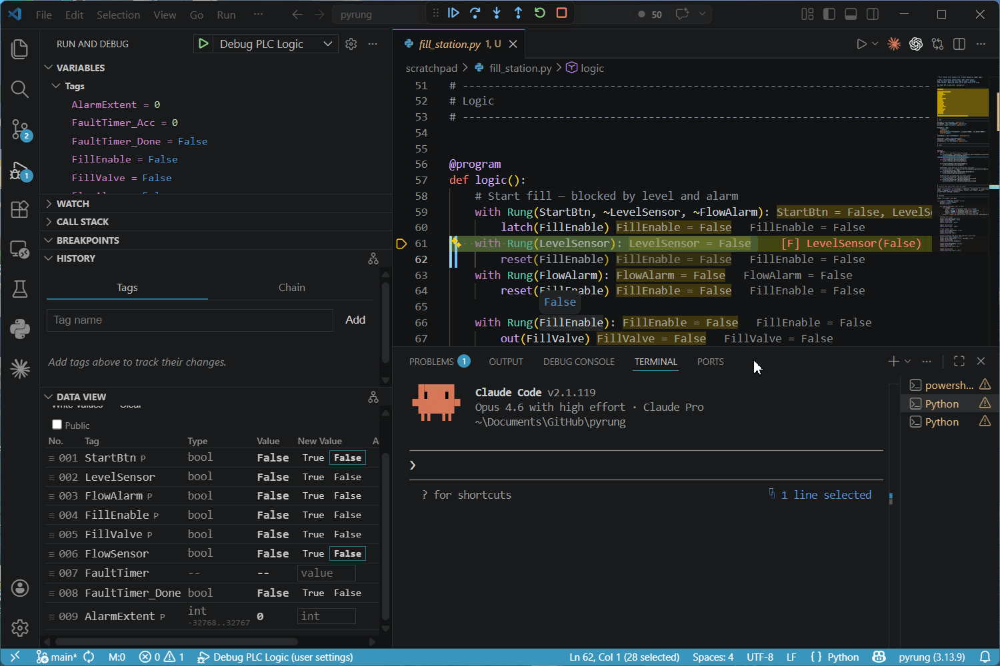

# Gradual Typing for Ladder Logic

If you build custom machines, you know the logic is never the hard part. A state machine, some interlocks, a handful of fault timers. You can sketch the whole control scheme on a napkin.

You've commissioned a machine and had it surprise you. Everything works at the bench, then something happens in the field because the logic did exactly what was written, just not what was meant. A flipped comparison, a missing contact, a path nobody tested because there wasn't time.

I build machines on Click PLCs. Click doesn't have a simulator, so I built one: [pyrung](https://ssweber.github.io/pyrung/), a Python library that runs the same scan cycle, instruction behavior, and rung evaluation order as a real Click. You write ladder logic as Python text with readable tag names and familiar rung structure, and pyrung executes it faithfully.

I built it to test before I commission, but the engine turned out to be capable of things I didn't originally think possible.

## The fill station

Say you have a tank, a fill valve, a flow sensor, and a level sensor. The logic is straightforward: open the valve, watch the flow, stop at level. A watchdog timer catches a dead flow sensor and an alarm fires if the watchdog trips. You could sketch it in five minutes.

Now, did you wire the alarm correctly? Does the watchdog actually fire if the flow sensor dies mid-fill? You find out at commissioning, or worse, in the field when a sensor fails and nothing happens.

With pyrung I could run scans and test this, but I spent most of my time writing grunt work: toggling inputs, faking sensor feedback, getting the timing right by hand. So I added annotations to the tags that represent physical devices. Light one-liners, similar to type hints, that you add where they're useful:

```python
ContactorFb: Bool = Field(
    physical=Physical("ContactorFb", on_delay="5ms"),
    link="ContactorCmd",
)
```

The test harness reads the annotations and automatically, on time, patches those inputs while running the simulation. I certainly am annoyed trying to commission when my feedback faults are set tight - I'm fast, but not 5ms fast on those clicks! The harness now does it for me, so tests describe the scenario I care about rather than twenty lines of input toggling to fake the physics.

Adding `min=`, `max=`, or `choices=` isn't just for the engineer in the VS Code extension's Data View. pyrung also checks those bounds every scan automatically.

## Checking every state

Now that the harness knows every feedback coupling on the machine, why don't we also use it to check that each device fault reaches an alarm?

```python
prove(logic, Or(~FillEnable, FlowSensor, AlarmExtent != 0))
```

That says: when the fill is running, either the flow sensor is responding or the alarm caught it. If that holds across every reachable combination of inputs and internal state, the result is `Proven`. If there's a gap, a path where the sensor dies and no alarm fires, the verifier finds it and hands back a step-by-step trace showing which inputs, which sequence, and which scan is where the rule breaks. If timing is important, I force each feedback off and run with real scan timing. Structural gaps and timing gaps both surface before the first wire is pulled. And those same `choices=` and `min=`/`max=` annotations prune the state space so verification stays tractable instead of exploding.

## Locking the behavior

Verification tells me the logic is right today, but I also want to know it's still right after someone (me) refactors the sequence or reorders the interlocks. pyrung can snapshot the reachable behavior into a lock file that gets committed and diffed on every change, the same idea as a package lock file but for machine behavior. `pyrung lock MODULE` - by default it locks all 'terminals': tags that get written but never read (like outputs), but you can add anything you want.

## Debugging backward

When something goes wrong in a test, I used to read rungs and mentally simulate. Now I ask the engine `cause(FlowAlarm)` ("Why did the alarm fire?"), tracing backward to the exact contact that flipped. `effect(StartCmd)` ("What happens if I push that?"). `recovers(FlowAlarm)` ("Can this fault latch ever clear?") checks whether a reset path exists. Once every scan is a snapshot, tracing cause and effect is just a query over the history.

## AI that can actually help with ladder

I've found LLMs are REALLY bad at ladder logic. I wrote a 'Click Cheatsheet' in pyrung for them. But still. Because the whole program executes every scan, every rung evaluates every time, and the implicit behavior emerges from hundreds of passes per second - sometimes they just don't get it.

pyrung gives the model what it needs. I work in VS Code stepping through scans while the model connects through `pyrung live`, a CLI that attaches to the running debug session from a second terminal where it can step itself, run cause/effect queries, patch and force tags, and inspect state in real time. It can also query the program structure, `upstream()` and `downstream()` of any tag, or the total `simplified()` And/Or chain that drives an output, so it's working from the actual dependency graph rather than reading source and inferring. It's nice having some help, especially one that's not guessing.



## Trust the simulation

pyrung's instruction set is manually verified against Click's documented and observed behavior, and a Modbus verification harness is in progress to catch the edge cases. Plain-English sentences like "memory writes are visible to the next instruction on the same scan" and "timer accumulator continues past preset up to the 32,767 clamp," each backed by a small ladder and a Modbus read that checks it against a real Click.

## The pitch

Everything I described here builds on the same tags, same scan cycle, same deterministic engine. The fill station that runs in a test suite is the same fill station that runs on a Click PLC. The bugs that used to surface at commissioning get caught the day I write the logic, not because I'm working harder but because the tools catch them the moment the program exists.

If you've felt that gap between "the logic looks right" and "I know it's right," that's the gap pyrung is built for. I'm still finding out what it can do.
