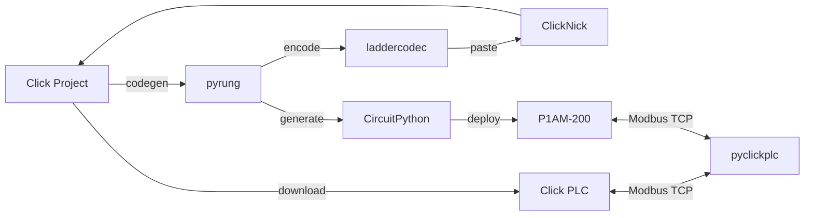

# Ladder Logic as Text

```python
from pyrung import Bool, Program, Rung, latch, reset

Start = Bool("Start")
Stop = Bool("Stop")
Motor = Bool("Motor")

with Program() as logic:
    with Rung(Start):
        latch(Motor)
    with Rung(Stop):
        reset(Motor)
```

That's a ladder rung. Condition on the `Rung`, instruction in the body. It reads like the diagram, runs as a deterministic scan cycle, tests with pytest, and compiles to real hardware.

Ladder logic dominates North American discrete manufacturing, but the tooling hasn't kept up. No version control, no automated testing, no way to simulate without hardware. The Structured Text crowd has options. The ladder crowd doesn't.

## pyrung

[pyrung](https://ssweber.github.io/pyrung/) is a Python DSL for writing, simulating, and testing ladder logic. The `with` block naturally separates the condition from the instruction, which is exactly what a ladder rung does. A controls engineer can map it to the diagram they already know.

Every scan produces an immutable state snapshot. Time is a variable you control. A DAP debugger lets you step through scans rung by rung in VS Code. Currently targets AutomationDirect Click PLC behavior faithfully: nearly the complete instruction set, memory banks, numeric quirks, scan-cycle semantics.

### Two deployment targets

pyrung compiles to two backends from the same source:

**Click PLC** via [laddercodec](https://github.com/ssweber/laddercodec). Your tested logic encodes to the bytes the CLICK editor expects on paste. No transposing by hand.

**ProductivityOpen P1AM-200** via CircuitPython code generation. Your tested logic becomes a self-contained scan loop that runs directly on the hardware, with the same Modbus TCP interface as a Click. No proprietary toolchain in the path.

Write it once, test it once, pick your target.



### Existing projects welcome

Generate pyrung code from an existing `.ckp` project. You don't have to start from scratch to get simulation and testing on programs you've already built.

## The supporting projects

Each of these works on its own, but they were designed to work with pyrung.

**[ClickNick](https://github.com/ssweber/clicknick)** is the Windows-side glue. Autocomplete over the CLICK editor's instruction dialogs, a modern address editor with bulk editing and search/replace, a tag browser with hierarchy and array grouping, a DataView editor with drag-and-drop, and clipboard integration for pasting encoded rungs. Works alongside your existing `.ckp` projects.

**[pyclickplc](https://ssweber.github.io/pyclickplc/)** is the Modbus TCP layer. Read and write registers on real Click hardware, or run pyrung as an emulated Click that any Modbus client can talk to. Also manages nickname and DataView files. Both the Click PLC and the P1AM-200 speak the same Modbus interface, so pyclickplc doesn't need to know which one it's talking to.

**[laddercodec](https://github.com/ssweber/laddercodec)** is the binary codec for Click's undocumented clipboard format. Encodes rungs described in CSV into the bytes the CLICK editor expects on paste. Reverse-engineered from scratch; the format remains undocumented by its creator.

## Limitations

pyrung simulates Click PLC behavior as faithfully as possible, but it is not a certified simulator. If your program behaves differently in pyrung than on a Click PLC, that's a bug we want to know about, but you should always validate on real hardware before deploying to production. The CircuitPython target runs on a garbage-collected runtime, so sub-millisecond scan timing is not realistic. Modbus TCP has no built-in authentication; keep it on isolated networks.

## Blog

- [These Aren't the Rungs You're Looking For](blog/these-arent-the-rungs.md) - How I reverse-engineered Click's clipboard format so my bytes could paste without any problems.
- [Why pyrung?](blog/why-pyrung.md) - A look at the PLC tooling landscape and where pyrung fits.
