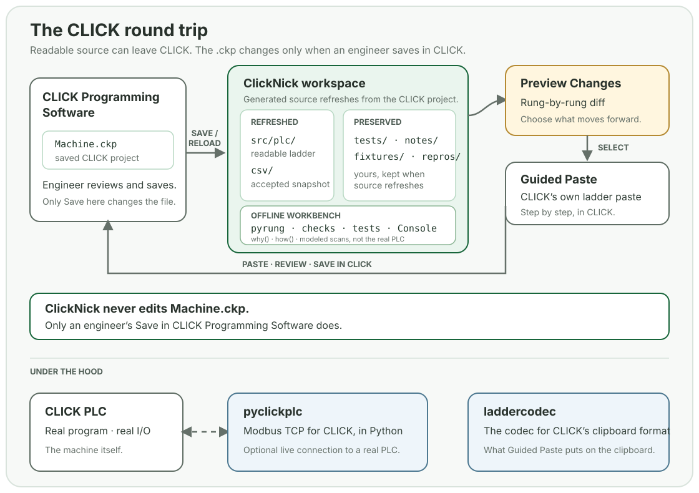

# How the pieces fit

Ladder logic dominates North American discrete manufacturing, but the tooling hasn't kept up. No version control, no automated testing, no way to simulate without hardware. The Structured Text crowd has options. The ladder crowd doesn't.

pyrung.com is the ladder crowd's option. The same program exists as readable text and as the ladder CLICK already runs, and the tools here move it between the two.

## The CLICK round trip

<picture class="overview-diagram">
  <source media="(max-width: 700px)" srcset="../assets/click-round-trip-mobile.svg">
  
</picture>

ClickNick opens beside CLICK Programming Software. Each time CLICK saves the project, ClickNick regenerates a workspace from it: the ladder as pyrung text, the accepted CSV snapshot, and a place for whatever the engineer keeps with the machine — tests, notes, reproductions. The generated files refresh on every save. The engineer's files stay.

The workspace is where the offline work happens. Nickname autocomplete and program checks are immediate. The Console runs scans without a PLC. Tests accumulate with the machine. Git is useful but optional; the files are ordinary text either way.

Changes go back into CLICK through the clipboard, the way rungs have always moved between CLICK projects. Preview Changes shows a rung-level diff of what you edited. Guided Paste puts the rungs you select on the clipboard in CLICK's native format. You paste, you save.

**ClickNick never edits a `.ckp`.** The project file changes only when an engineer saves it in CLICK Programming Software.

The workspace is also where an AI agent works, if you use one. It can read the source, propose tests, and edit files. It has no other route to the PLC than the one above.

## Where the program runs

The text in the workspace is a pyrung program. [pyrung](https://pyrung.com/pyrung/) is a Python DSL for writing, simulating, and testing ladder logic: the `with` block separates the condition from the instruction, which is exactly what a rung does. Every scan produces an immutable state snapshot. Time is a variable you control. A DAP debugger steps through scans rung by rung in VS Code.

| Where | What runs | Use it for |
| --- | --- | --- |
| CLICK PLC | The project downloaded from CLICK Programming Software | The real machine: commissioning, production, live checks over Modbus |
| Your workstation | pyrung's scan engine on the workspace source | Tests, scan stepping, `why()`, `how()` — no PLC needed |
| P1AM-200 | CircuitPython generated from the same pyrung source | Running text-authored ladder on that board |

The P1AM-200 is the second target. The same tested pyrung program generates a self-contained CircuitPython scan loop that runs directly on the board, with the same Modbus TCP interface as a CLICK. No proprietary toolchain in the path. Write it once, test it once, pick your target.

## Limits

pyrung simulates CLICK PLC behavior as faithfully as possible, but it is not a certified simulator. It models the program — scans, instructions, tags, timers — not the wiring, the sensors, or the firmware. If your program behaves differently in pyrung than on a CLICK PLC, that's a bug we want to know about, but you should always validate on real hardware before deploying to production. The CircuitPython target runs on a garbage-collected runtime, so sub-millisecond scan timing is not realistic. Modbus TCP has no built-in authentication; keep it on isolated networks.

## Under the hood

pyclickplc

### Modbus TCP for CLICK, in Python

Read and write CLICK registers as native Python values by bank, address, or nickname, or run a local Modbus TCP server that any Modbus client can talk to. Also manages nickname CSV and DataView files.

[Explore pyclickplc →](https://pyrung.com/pyclickplc/)

laddercodec

### The codec for CLICK's clipboard format

Decodes CLICK clipboard and program-file bytes into rungs, and encodes rungs back into native clipboard data. Reverse-engineered from scratch; the format remains undocumented by its creator. ClickNick uses it under the hood.

[Read the binary format →](https://pyrung.com/laddercodec/internals/binary-format/)

## Choose a starting point

- Have a `.ckp`? Start with [ClickNick](https://pyrung.com/clicknick/).
- Want to write ladder in Python? Read the [pyrung docs](https://pyrung.com/pyrung/).
- Want the design history? Browse the [Blog](blog/index.md).
